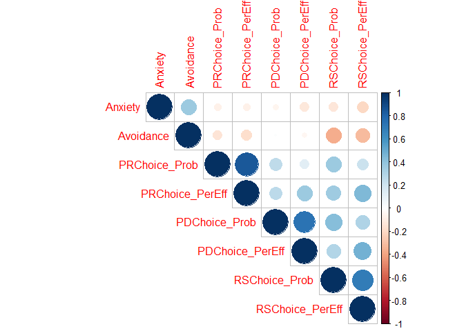

Thesis-Study-2
================
Fanyi Zeng
2022-05-05

In my study 2, I examined how attachment dimensions affect attitudes
towards strategies (probability and perceived effectiveness of use) and
actual behaviroral choice among the strategies.

Attachment avoidance was significantly, positively correlated with
attachment anxiety. This shows that the more avoidantly attached an
individual is, the more likely that this person is anxiously attached,
and vice versa. This also indicates the importance of controlling for
the other dimension to predict an outcome.

As predicted, attachment avoidance was negatively, significantly
correlated with the probability of using relational savoring,and the
perceived effectiveness of using relational savoring. When controlling
for attachment anxiety, the above relationships held. As such, the more
avoidantly attached individuals are with their close other, the less
they may consider using relational savoring strategy or perceive it as
adaptive to cope with a recent conflict with their close other.

Contrary to predictions, attachment anxiety was not significantly
correlated with the probability of using positive reappraisal, or the
perceived effectiveness of using positive reappraisal. When controlling
for attachment avoidance, the above relationships held. As such, more
anxiously attached individuals might not differ much from less anxiously
attached individuals in their consideration and evaluation of using
positive reappraisal to cope with a recent conflict with their close
other.

``` r
cor1<-rcorr(as.matrix(Study2[,c(31:36,63,62)]))
corrplot(cor1$r, type="upper", order="hclust", 
         p.mat = cor1$p, sig.level = 0.05, insig = "blank")
```

<!-- -->

``` r
m1 <- lm(PRChoice_Prob ~ Anxiety + Avoidance, Study2)
summary(m1)
```

    ## 
    ## Call:
    ## lm(formula = PRChoice_Prob ~ Anxiety + Avoidance, data = Study2)
    ## 
    ## Residuals:
    ##     Min      1Q  Median      3Q     Max 
    ## -4.9753 -2.7617  0.1123  2.4747  6.4594 
    ## 
    ## Coefficients:
    ##             Estimate Std. Error t value Pr(>|t|)    
    ## (Intercept)  5.45900    0.65494   8.335 1.04e-13 ***
    ## Anxiety     -0.06029    0.17878  -0.337    0.736    
    ## Avoidance   -0.38325    0.27102  -1.414    0.160    
    ## ---
    ## Signif. codes:  0 '***' 0.001 '**' 0.01 '*' 0.05 '.' 0.1 ' ' 1
    ## 
    ## Residual standard error: 3.077 on 128 degrees of freedom
    ##   (4 observations deleted due to missingness)
    ## Multiple R-squared:  0.02158,    Adjusted R-squared:  0.006297 
    ## F-statistic: 1.412 on 2 and 128 DF,  p-value: 0.2474

``` r
m2 <- lm(PRChoice_PerEff ~ Anxiety + Avoidance, Study2)
summary(m2)
```

    ## 
    ## Call:
    ## lm(formula = PRChoice_PerEff ~ Anxiety + Avoidance, data = Study2)
    ## 
    ## Residuals:
    ##     Min      1Q  Median      3Q     Max 
    ## -4.2868 -2.6138 -0.3654  2.2011  7.0834 
    ## 
    ## Coefficients:
    ##             Estimate Std. Error t value Pr(>|t|)    
    ## (Intercept)  4.80255    0.61393   7.823 1.68e-12 ***
    ## Anxiety     -0.03346    0.16759  -0.200   0.8420    
    ## Avoidance   -0.45998    0.25405  -1.811   0.0725 .  
    ## ---
    ## Signif. codes:  0 '***' 0.001 '**' 0.01 '*' 0.05 '.' 0.1 ' ' 1
    ## 
    ## Residual standard error: 2.884 on 128 degrees of freedom
    ##   (4 observations deleted due to missingness)
    ## Multiple R-squared:  0.03113,    Adjusted R-squared:  0.01599 
    ## F-statistic: 2.056 on 2 and 128 DF,  p-value: 0.1321

``` r
m3 <- lm(RSChoice_Prob ~ Anxiety + Avoidance, Study2)
summary(m3)
```

    ## 
    ## Call:
    ## lm(formula = RSChoice_Prob ~ Anxiety + Avoidance, data = Study2)
    ## 
    ## Residuals:
    ##     Min      1Q  Median      3Q     Max 
    ## -7.5457 -1.5407  0.5987  1.4648  4.1786 
    ## 
    ## Coefficients:
    ##               Estimate Std. Error t value Pr(>|t|)    
    ## (Intercept)  8.5522593  0.5047604  16.943  < 2e-16 ***
    ## Anxiety     -0.0006829  0.1377849  -0.005    0.996    
    ## Avoidance   -0.8621751  0.2088718  -4.128 6.56e-05 ***
    ## ---
    ## Signif. codes:  0 '***' 0.001 '**' 0.01 '*' 0.05 '.' 0.1 ' ' 1
    ## 
    ## Residual standard error: 2.372 on 128 degrees of freedom
    ##   (4 observations deleted due to missingness)
    ## Multiple R-squared:  0.1328, Adjusted R-squared:  0.1192 
    ## F-statistic: 9.799 on 2 and 128 DF,  p-value: 0.0001097

``` r
m4 <- lm(RSChoice_PerEff ~ Anxiety + Avoidance, Study2)
summary(m4)
```

    ## 
    ## Call:
    ## lm(formula = RSChoice_PerEff ~ Anxiety + Avoidance, data = Study2)
    ## 
    ## Residuals:
    ##     Min      1Q  Median      3Q     Max 
    ## -6.8723 -1.8172  0.5669  2.0488  5.5563 
    ## 
    ## Coefficients:
    ##             Estimate Std. Error t value Pr(>|t|)    
    ## (Intercept)   7.9054     0.5724  13.810  < 2e-16 ***
    ## Anxiety      -0.1762     0.1563  -1.127  0.26169    
    ## Avoidance    -0.7345     0.2369  -3.101  0.00237 ** 
    ## ---
    ## Signif. codes:  0 '***' 0.001 '**' 0.01 '*' 0.05 '.' 0.1 ' ' 1
    ## 
    ## Residual standard error: 2.689 on 128 degrees of freedom
    ##   (4 observations deleted due to missingness)
    ## Multiple R-squared:  0.1074, Adjusted R-squared:  0.09349 
    ## F-statistic: 7.704 on 2 and 128 DF,  p-value: 0.0006933

``` r
m5 <- lm(PDChoice_Prob ~ Anxiety + Avoidance, Study2)
summary(m5)
```

    ## 
    ## Call:
    ## lm(formula = PDChoice_Prob ~ Anxiety + Avoidance, data = Study2)
    ## 
    ## Residuals:
    ##     Min      1Q  Median      3Q     Max 
    ## -5.8702 -1.7575  0.4432  2.1931  4.6365 
    ## 
    ## Coefficients:
    ##             Estimate Std. Error t value Pr(>|t|)    
    ## (Intercept)   5.7392     0.5769   9.948   <2e-16 ***
    ## Anxiety      -0.1095     0.1575  -0.695    0.488    
    ## Avoidance     0.0902     0.2387   0.378    0.706    
    ## ---
    ## Signif. codes:  0 '***' 0.001 '**' 0.01 '*' 0.05 '.' 0.1 ' ' 1
    ## 
    ## Residual standard error: 2.711 on 128 degrees of freedom
    ##   (4 observations deleted due to missingness)
    ## Multiple R-squared:  0.003908,   Adjusted R-squared:  -0.01166 
    ## F-statistic: 0.2511 on 2 and 128 DF,  p-value: 0.7784

``` r
m6 <- lm(PDChoice_PerEff ~ Anxiety + Avoidance, Study2)
summary(m6)
```

    ## 
    ## Call:
    ## lm(formula = PDChoice_PerEff ~ Anxiety + Avoidance, data = Study2)
    ## 
    ## Residuals:
    ##     Min      1Q  Median      3Q     Max 
    ## -5.0740 -1.8649  0.2802  1.9959  5.2088 
    ## 
    ## Coefficients:
    ##              Estimate Std. Error t value Pr(>|t|)    
    ## (Intercept)  5.289094   0.567160   9.326 4.26e-16 ***
    ## Anxiety     -0.210579   0.154818  -1.360    0.176    
    ## Avoidance   -0.003899   0.234693  -0.017    0.987    
    ## ---
    ## Signif. codes:  0 '***' 0.001 '**' 0.01 '*' 0.05 '.' 0.1 ' ' 1
    ## 
    ## Residual standard error: 2.665 on 128 degrees of freedom
    ##   (4 observations deleted due to missingness)
    ## Multiple R-squared:  0.01648,    Adjusted R-squared:  0.001115 
    ## F-statistic: 1.073 on 2 and 128 DF,  p-value: 0.3452

I also found that attachment avoidance significantly, positively
predicted the choice of positive distraction over relational savoring,
when controlling for attachment anxiety.

``` r
m7 <- lm(ERChoice ~ Anxiety+Avoidance, Study2)
summary(m7)
```

    ## 
    ## Call:
    ## lm(formula = ERChoice ~ Anxiety + Avoidance, data = Study2)
    ## 
    ## Residuals:
    ##      Min       1Q   Median       3Q      Max 
    ## -1.28195 -0.20511  0.01304  0.65992  1.09622 
    ## 
    ## Coefficients:
    ##             Estimate Std. Error t value Pr(>|t|)    
    ## (Intercept)  1.87070    0.14125  13.244   <2e-16 ***
    ## Anxiety     -0.02498    0.03856  -0.648   0.5183    
    ## Avoidance    0.12466    0.05845   2.133   0.0349 *  
    ## ---
    ## Signif. codes:  0 '***' 0.001 '**' 0.01 '*' 0.05 '.' 0.1 ' ' 1
    ## 
    ## Residual standard error: 0.6636 on 128 degrees of freedom
    ##   (4 observations deleted due to missingness)
    ## Multiple R-squared:  0.03444,    Adjusted R-squared:  0.01935 
    ## F-statistic: 2.283 on 2 and 128 DF,  p-value: 0.1061

Both studies established a strong, negative link between attachment
avoidance and relational savoring. Study 1 found that people who were
more avoidantly attached in close relationships used significantly less
relational savoring to cope with stress from general interpersonal
conflicts. Study 2 found that people who were more avoidantly attached
with their close others (i.e., in a specific close relationship) rated
the use of relational savoring as significantly less likely and less
effective to cope with a recent interpersonal conflict with their close
others, and they also chose relational savoring significantly less
frequently positive distraction.

It seems that more avoidantly attached individuals’ aversion to
relational savoring is consistent across situations. This is supported
by studies that linked attachment avoidance with lower savoring,
especially savoring interpersonal events or savoring via social
activities, but not those that are non-interpersonal, such as a personal
achievement (Borelli et al., 2014; Goodall, 2015; Palmer & Gentzler,
2019). This is also consistent with attachment theory that avoidantly
attached individuals admire independence and depreciate interdependence
(e.g., Bowlby, 1982; Cassidy & Kobak, 1988; Mikulincer & Shaver, 2003),
so they try to eschew anything that might close their distance with
others and expose their vulnerabilities. Perhaps, more important than
teaching these individuals to use relational savoring is to teach them
to overcome the fear of, build the trust in, and improve the skills to
healthy relationships.
